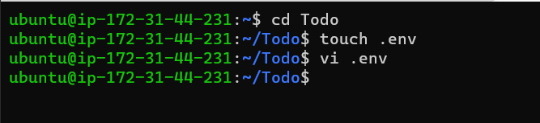

# Project-3

SIMPLE TO-DO APPLICATION ON MERN WEB STACK

In this project, we will implement a web solution based on MERN stack in AWS Cloud

Make a research what types of Database Management Systems (DBMS) exist and what each type is more suitable for. Be able to explain the difference between Relational DBMS and NoSQL (of a different kind)

[database management system](https://en.wikipedia.org/wiki/Web_framework)

[RESTful API](https://restfulapi.net/)

# BACKEND CONFIGURATION

To update ubuntu, we would run

sudo apt update

To upgrade ubuntu, again we run

sudo apt upgrade

Lets get the location of Node.js software from Ubuntu repositories.

curl -fsSL https://deb.nodesource.com/setup_18.x | sudo -E bash -

Install Node.js on the server

Install Node.js with the command below

sudo apt-get install -y nodejs

Note: The command above installs both nodejs and npm. NPM is a package manager for Node like apt for Ubuntu, it is used to install Node modules & packages and to manage dependency conflicts

Verify the node installation with the command below

node -v 
Verify the node installation with the command below

npm -v 

Application Code Setup

Create a new directory for your To-Do project:

mkdir Todo

Run the command below to verify that the Todo directory is created with ls command

ls

Now change your current directory to the newly created one:

cd Todo

Next, you will use the command npm init to initialise your project, so that a new file named package.json will be created. This file will normally contain information about your application and the dependencies that it needs to run. Follow the prompts after running the command. You can press Enter several times to accept default values, then accept to write out the package.json file by typing yes.

npm init

Run the command ls to confirm that you have package.json file created

# INSTALL EXPRESSJS

Express is a framework for Node.js, therefore a lot of things developers would have programmed is already taken care of out of the box. Therefore it simplifies development, and abstracts a lot of low level details. For example, Express helps to define routes of your application based on HTTP methods and URLs.

To use express, install it using npm:

npm install express

Now create a file index.js with the command below

touch index.js

Then run ls to confirm that your index.js file is successfully created

Install the dotenv module

npm install dotenv

Open the index.js file with the command below

vim index.js

Type the code below into it and save then paste the code into the file.

Notice that we have specified to use port 5000 in the code. This will be required later when we go on the browser.

Use :w to save in vim and use :qa to exit vim

Now it is time to start our server to see if it works. Open your terminal in the same directory as your index.js file and type:

node index.js

If every thing goes well, you should see Server running on port 5000 in your terminal

Now we need to open this port in EC2 Security Groups to create inbound rule to open TCP port 5000

Open up your browser and try to access your server’s Public IP or Public DNS name followed by port 5000:

http://<PublicIP-or-PublicDNS>:5000

Again, create a folder routes by running  the below command

mkdir routes

Change directory to routes folder.

cd routes
Now, create a file api.js with the command below

touch api.js

Open the file with the command below

vim api.js

# MODELS

A model is at the heart of JavaScript based applications, and it is what makes it interactive

We will also use models to define the database schema 

To create a Schema and a model, install mongoose which is a Node.js package that makes working with mongodb easier

npm install mongoose

Create a new folder models :

mkdir models
Change directory into the newly created ‘models’ folder with

cd models
Inside the models folder, create a file and name it todo.js

touch todo.js

All three commands above can be defined in one line to be executed consequently with help of && operator by running the command below

mkdir models && cd models && touch todo.js

Then Open the file created by running this command

vim todo.js

Now we need to update our routes from the file api.js in ‘routes’ directory to make use of the new model.

In Routes directory, open api.js with vim api.js, delete the code inside with :%d command and paste there code below into it then save and exit

# MONGODB DATABASE

We need a database where we will store our data. For this we will make use of mLab. mLab provides MongoDB database as a service solution (DBaaS)

Allow access to the MongoDB database from anywhere

Also, In the image below, change the time of deleting the entry from 6 Hours to 1 Week

Create a MongoDB database and collection inside mLabreate a MongoDB database and collection inside mLab

Create a file in your Todo directory and name it .env.

touch .env
vi .env

Add the connection string to access the database in it, just as below:

DB = 'mongodb+srv://<username>:<password>@<network-address>/<dbname>?retryWrites=true&w=majority'

DB = "mongodb+srv://Michael1/:Michael1/@cluster0.rvuyi4d.mongodb.net/TinaDB?retryWrites=true&w=majority"

Now we need to update the index.js to reflect the use of .env so that Node.js can connect to the database

Now we need to update the index.js to reflect the use of .env so that Node.js can connect to the database.

Simply delete existing content in the file, and update it with the entire code below.

To do that using vim, follow below steps

Open the file with vim index.js
Press esc
Type :
Type %d
Hit ‘Enter’

The entire content will be deleted, then,

Press i to enter the insert mode in vim
Now, paste the entire code below in the file.

Using environment variables to store information is considered more secure and best practice to separate configuration and secret data from the application, instead of writing connection strings directly inside the index.js application file.

Start your server using the command:

node index.js

You shall see a message ‘Database connected successfully’, if so – we have our backend configured. Now we are going to test it.

# Testing Backend Code without Frontend using RESTful API

we will use Postman to test our API

how to perform CRUD operartions on Postman [CRUD](https://en.wikipedia.org/wiki/Create,_read,_update_and_delete)

You should test all the API endpoints and make sure they are working. For the endpoints that require body, you should send JSON back with the necessary fields since it’s what we setup in our code.

Now open your Postman, create a POST request to the API http://<PublicIP-or-PublicDNS>:5000/api/todos. This request sends a new task to our To-Do list so the application could store it in the database.

ensure you set header key Content-Type as application/json

Having done with the header then next to the Body

Create a GET request to your API on http://<PublicIP-or-PublicDNS>:5000/api/todos. This request retrieves all existing records from out To-do application (backend requests these records from the database and sends it us back as a response to GET request).

# Frontend creation

Since we are done with the functionality we want from our backend and API, it is time to create a user interface for a Web client (browser) to interact with the application via API. To start out with the frontend of the To-do app, we will use the create-react-app command to scaffold our app.

In the same root directory as your backend code, which is the Todo directory, run:

 npx create-react-app client
This will create a new folder in your Todo directory called client

This will create a new folder in your Todo directory called client, where you will add all the react code.

Running a React App
Before testing the react app, there are some dependencies that need to be installed

Install concurrently. It is used to run more than one command simultaneously from the same terminal window.

npm install concurrently --save-dev

Install nodemon. It is used to run and monitor the server. If there is any change in the server code, nodemon will restart it automatically and load the new changes.

npm install nodemon --save-dev

In Todo folder open the package.json file. Change the highlighted part of the below screenshot and replace with the code below.

Configure Proxy in package.json
Change directory to ‘client’

cd client

Open the package.json file

vi package.json

Add the key value pair in the package.json file "proxy": "http://localhost:5000"

The whole purpose of adding the proxy configuration in number 3 above is to make it possible to access the application directly from the browser by simply calling the server url like http://localhost:5000 rather than always including the entire path like http://localhost:5000/api/todos

Now, ensure you are inside the Todo directory, and simply do:

npm run dev

Your app should open and start running on localhost:3000

In order to be able to access the application from the Internet you have to open TCP port 3000 on EC2 by adding a new Security Group rule.

Creating your React Components
One of the advantages of react is that it makes use of components, which are reusable and also makes code modular. For our Todo app, there will be two stateful components and one stateless component.
From your Todo directory run

cd client
move to the src directory

cd src
Inside your src folder create another folder called components

mkdir components
Move into the components directory with

cd components

Inside ‘components’ directory create three files Input.js, ListTodo.js and Todo.js.

touch Input.js ListTodo.js Todo.js

Open Input.js file

vi Input.js

To make use of Axios, which is a Promise based HTTP client for the browser and node.js, you need to cd into your client from your terminal and run yarn add axios or npm install axios.

Move to the src folder

cd ..
Move to clients folder

cd ..
Install Axios

npm install axios

Go to ‘components’ directory

cd src/components
After that open your ListTodo.js

vi ListTodo.js

in the ListTodo.js copy and paste the following code

Then in your Todo.js file again paste following code

Make sure that you are in the src folder and run

vi App.js

Copy and paste the code below into it

In the src directory open the App.css

vi App.css

Then paste the following code into App.css

Exit

In the src directory open the index.css

vim index.css

Copy and paste the code below

Go to the Todo directory

cd ../..
When you are in the Todo directory run:

npm run dev

